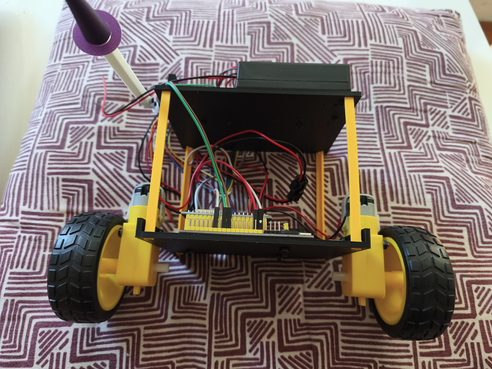
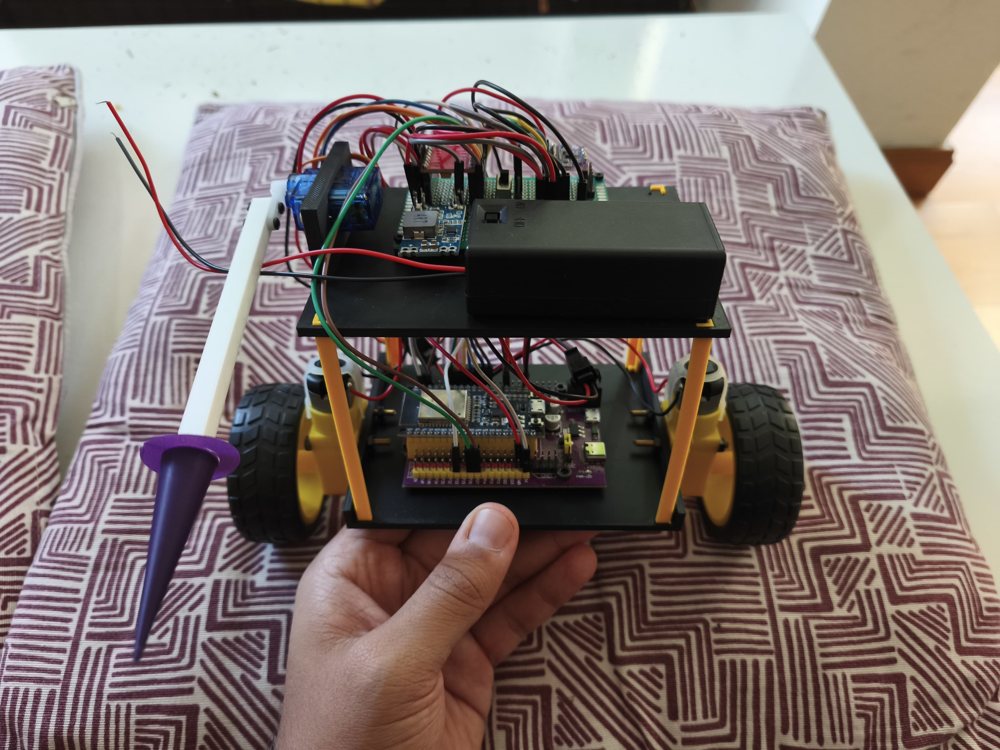
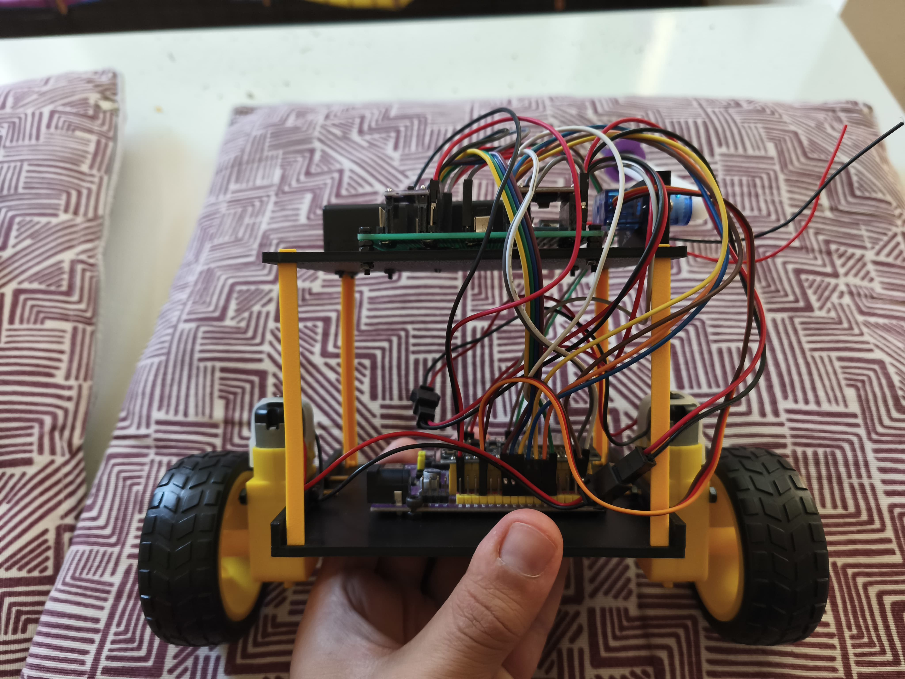
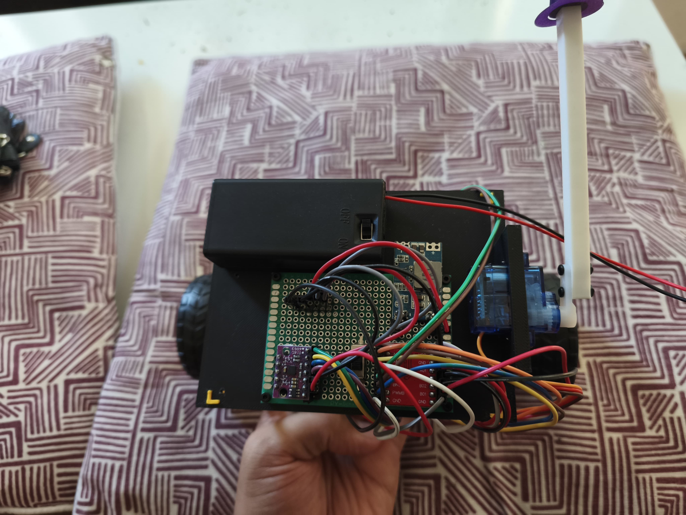
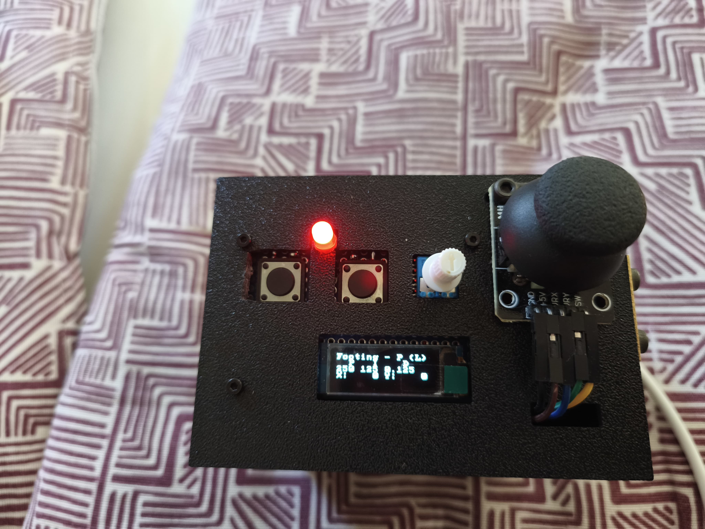
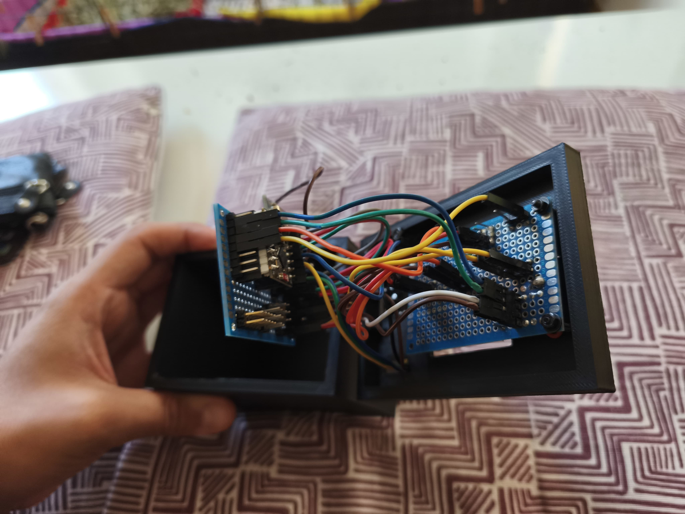
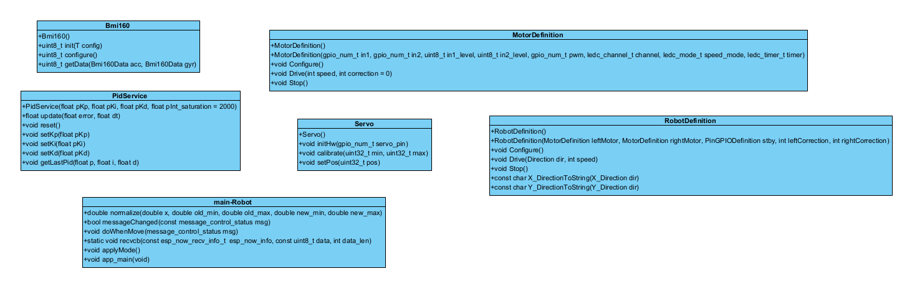
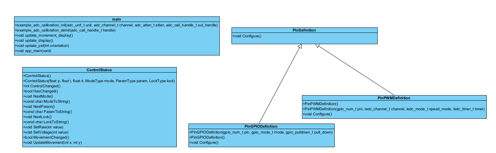
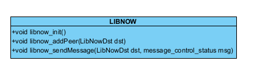

# Project of Self-balancing bot 'Equili-bot-ista'
The 'Equili-bot-ista' / 'Roborracho' / 'Robotis Yeltsin' is a self-balancing robot which tries to keeb standing and can be controlled with a joystick control and wields a spear.

## Technologies
- ESP32 with ESP-IDF framework
- C++

## Functionalities
- Self balancing robot
- Two modes: Fighting and Footing (Spear position)
- Drive can be remotely controlled
- Adjustment of PID on the go with remote control

## Demo
### Robot
### Control

## Media

## Schema
### Main robot

### Control

## Class diagram

Guided by:
https://github.com/LaboratorioGluon
